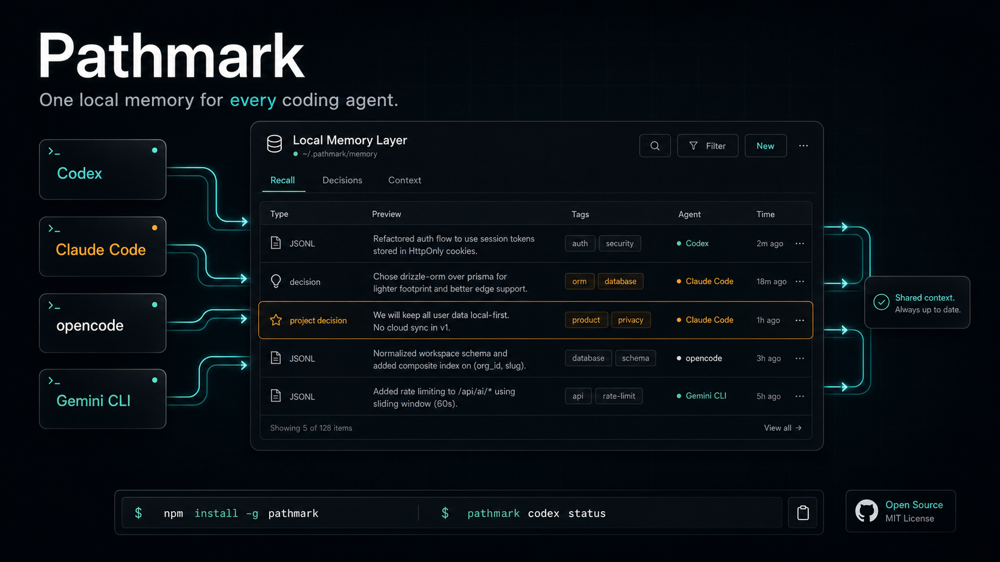

# Pathmark

Stop re-explaining your repo each time you switch agents.

<p align="center">
  
</p>

Pathmark gives Codex, Claude Code, opencode, Gemini CLI, Cursor, and any MCP-capable harness one local memory layer. Save decisions, project rules, preferences, and conclusions once. Use them from the next agent without pasting a recap.

Your context stays on disk at `~/.pathmark/memory/memory.jsonl`. You do not need an account, hosted database, API key, or vendor backend to start.

## Why Pathmark

You do not work in one tool. You ask Codex to patch, Claude Code to review, opencode to clean up, and Gemini CLI to challenge the plan. Each tool starts cold unless you carry the context across.

Pathmark gives those tools one place to read and write memory:

- One local JSONL store across harnesses.
- Standard MCP tools: `remember`, `search_memory`, `get_context`, and `ask_memory`.
- Client-side synthesis by default, so your coding agent reads the context and answers.
- Optional Codex CLI, local command, and OpenAI-compatible synthesis modes.
- Plain files you can inspect, back up, delete, or migrate.

Pathmark stays provider-neutral. Codex gets one optional synthesis preset. The core server works with any MCP client that can use local tools.

## Cross-Harness Memory

You switch tools during a coding session:

- Codex fixes the failing test.
- Claude Code reviews the patch.
- opencode cleans the diff.
- Gemini CLI challenges the approach.

Pathmark keeps the notes in one store.

Point each harness at the same store:

```text
Codex       \
Claude Code \
opencode     >  Pathmark MCP  >  ~/.pathmark/memory/memory.jsonl
Gemini CLI  /
Cursor     /
```

Install Pathmark in each harness and point them at the same `PATHMARK_STORE_DIR`. One tool saves context with `remember` or `create_conclusion`; the next tool recovers it with `search_memory`, `get_context`, or `ask_memory`.

Pathmark sits below the agents as a memory bus for your coding workflow.

## Tools

Pathmark exposes these MCP tools:

| Tool | Purpose |
| --- | --- |
| `remember` | Save a raw memory item. |
| `create_conclusion` | Save a higher-signal durable conclusion or preference. |
| `search_memory` | Search memories and conclusions. |
| `get_context` | Return compact context for a task or question. |
| `list_conclusions` | List saved conclusions. |
| `delete_memory` | Soft-delete a memory or conclusion by id. |
| `ask_memory` | Return relevant context, or synthesize with `PATHMARK_CHAT_COMMAND` if configured. |
| `chat` | Chat-compatible alias for `ask_memory`; returns the retrieved context so the client can show what was used. |
| `get_config` | Show local store configuration. |

## Quick Start

```bash
npm install -g pathmark
```

Then add the MCP server to your client.

Prefer npm for normal installs. To test the current GitHub `main` branch directly:

```bash
npm install -g --install-links=true github:hacksurvivor/pathmark
```

Generate a setup snippet for your harness:

```bash
pathmark setup list
pathmark setup claude-code
pathmark setup opencode --json
pathmark setup gemini-cli
pathmark setup kimi
```

See [docs/compatibility.md](docs/compatibility.md) for Codex, Claude Code, opencode, Gemini CLI, OpenClaw, Hermes Agent, Grok CLI, Kimi, GLM, and generic MCP setups.

### Codex

```bash
codex mcp add pathmark -- pathmark
```

Codex users can also enable auto-capture:

```bash
pathmark codex install --replace-legacy-hooks
```

### Claude Code

```bash
claude mcp add pathmark -- pathmark
```

### opencode / Gemini CLI

Use the generated snippets:

```bash
pathmark setup opencode
pathmark setup gemini-cli
```

### Claude Desktop

Add this to your Claude Desktop MCP config:

```json
{
  "mcpServers": {
    "pathmark": {
      "command": "pathmark",
      "env": {
        "PATHMARK_STORE_DIR": "~/.pathmark/memory"
      }
    }
  }
}
```

### Cursor

Add the same command to Cursor's MCP server settings:

```json
{
  "mcpServers": {
    "pathmark": {
      "command": "pathmark"
    }
  }
}
```

## Local Development

```bash
npm install
npm run build
npm run smoke
```

Run directly:

```bash
PATHMARK_STORE_DIR=.pathmark npm run dev
```

## Import Legacy Memory

Pathmark can import a compatible local JSONL memory store without deleting or moving the source files.

```bash
npm run import:legacy -- --source-dir ~/old-codex-memory
```

Defaults:

```text
Legacy source:   ~/.pathmark/legacy/codex
Pathmark target: ~/.pathmark/memory/memory.jsonl
```

The importer creates a `memory.jsonl.backup-*` file before writing, uses deterministic ids so reruns skip duplicates, and redacts obvious `KEY=...`, `TOKEN=...`, `PASSWORD=...`, and `Bearer ...` values.

Use a dry run first when migrating another machine:

```bash
npm run import:legacy -- --source-dir ~/old-codex-memory --dry-run
```

## Codex Auto-Capture

Install Pathmark as the Codex memory adapter:

```bash
pathmark codex install --replace-legacy-hooks
```

This registers the Pathmark MCP server, enables Codex hooks, and removes old compatible hook commands from Codex. It does not delete or move memory files.

Use `--replace-legacy-hooks` when you want Pathmark hooks to take over from earlier compatible hook commands. Without it, Pathmark installs alongside existing hook commands.

Check the adapter status:

```bash
pathmark codex status
```

The status output is JSON and includes Pathmark hook state, MCP registration state, legacy hook presence, the active store paths, and the current record count.

Remove Pathmark hooks and MCP registration without deleting memory:

```bash
pathmark codex uninstall
```

## Configuration

| Variable | Default | Description |
| --- | --- | --- |
| `PATHMARK_STORE_DIR` | `~/.pathmark/memory` | Directory for `memory.jsonl`. |
| `PATHMARK_MAX_SEARCH_RESULTS` | `12` | Default search limit. |
| `PATHMARK_SYNTHESIS_PROVIDER` | `client` | `client`, `command`, `codex`, or `openai-compatible`. |
| `PATHMARK_CHAT_COMMAND` | unset | Command provider: receives a synthesized prompt on stdin and writes an answer on stdout. |
| `PATHMARK_CODEX_COMMAND` | `codex` | Codex provider command. |
| `PATHMARK_CODEX_MODEL` | unset | Optional Codex model override. |
| `PATHMARK_OPENAI_BASE_URL` | `https://api.openai.com/v1` | OpenAI-compatible API base URL. |
| `PATHMARK_OPENAI_API_KEY` | unset | OpenAI-compatible API key. |
| `PATHMARK_OPENAI_MODEL` | unset | Model id for OpenAI-compatible synthesis. |
| `PATHMARK_CHAT_TIMEOUT_MS` | `120000` | Synthesis command timeout. |

## Synthesis Modes

Pathmark separates memory from reasoning.

### `client`

Default. The MCP server returns relevant memory context, and your MCP client model synthesizes the answer. This works across Codex, Claude Desktop, Cursor, and any other MCP client without giving Pathmark a model credential.

```bash
PATHMARK_SYNTHESIS_PROVIDER=client pathmark
```

### `command`

Use any local subscription or model CLI that accepts a prompt on stdin and writes an answer to stdout:

```bash
PATHMARK_SYNTHESIS_PROVIDER=command \
PATHMARK_CHAT_COMMAND="your-ai-cli --model your-model" \
pathmark
```

This is the general path for users with another paid subscription CLI or a local model runner.

### `codex`

Use the proven Codex CLI bridge. It runs a controlled, non-interactive `codex exec` turn with hooks and memories disabled to avoid recursion:

```bash
PATHMARK_SYNTHESIS_PROVIDER=codex \
PATHMARK_CODEX_MODEL=gpt-5.5 \
pathmark
```

This is useful for Codex users who have ChatGPT/Codex subscription auth locally but do not want to add an OpenAI API key.

### `openai-compatible`

Use any provider that exposes `/chat/completions`, including many Kimi, GLM/Z.ai, OpenRouter, LiteLLM, Ollama-compatible gateways, and self-hosted routers:

```bash
PATHMARK_SYNTHESIS_PROVIDER=openai-compatible \
PATHMARK_OPENAI_BASE_URL=https://api.provider.example/v1 \
PATHMARK_OPENAI_API_KEY=... \
PATHMARK_OPENAI_MODEL=... \
pathmark
```

This mode only affects `ask_memory`. Regular MCP tools still store and retrieve local memory without a model provider.

## Setup CLI

`pathmark setup <client>` prints copy-paste setup for common harnesses. Add `--json` when you want structured output for scripts.

Supported targets:

```text
codex
claude-code
claude-desktop
cursor
opencode
gemini-cli
generic
openai-compatible
command
```

Aliases include `claude`, `gemini`, `kimi`, `glm`, and `z-ai`.

## Data Format

Pathmark stores newline-delimited JSON at:

```text
~/.pathmark/memory/memory.jsonl
```

Each record is inspectable:

```json
{
  "id": "uuid",
  "kind": "memory",
  "text": "The user prefers local-first tools.",
  "tags": ["preference"],
  "source": "mcp",
  "createdAt": "2026-06-29T00:00:00.000Z",
  "updatedAt": "2026-06-29T00:00:00.000Z"
}
```

Deletes are soft deletes: the record gets a `deletedAt` timestamp.

## Roadmap

- Harness installers for Codex, Claude Code, opencode, Gemini CLI, and other MCP clients.
- Optional auto-capture hooks/importers per harness, so useful context can be saved with less prompting.
- Provider presets for common local AI CLIs where stable commands exist.
- Import/export commands for other memory systems.
- Better ranking with optional local embeddings.
- Namespaces for projects, teams, and clients.
- Encrypted store option.
- Hosted sync as an opt-in layer, not a requirement.
- Example recipes for Codex, Claude Desktop, Cursor, ChatGPT, and local LLM tools.

## Positioning

Pathmark gives your agents a shared working memory that stays on your machine.

> Switch agents. Keep the context.

> Bring your own subscription. Keep your memory local.

## License

MIT
